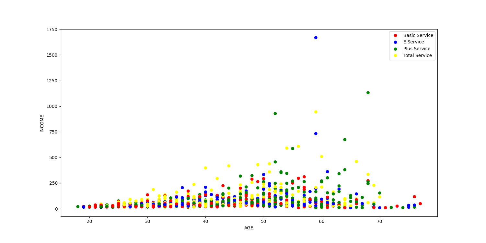
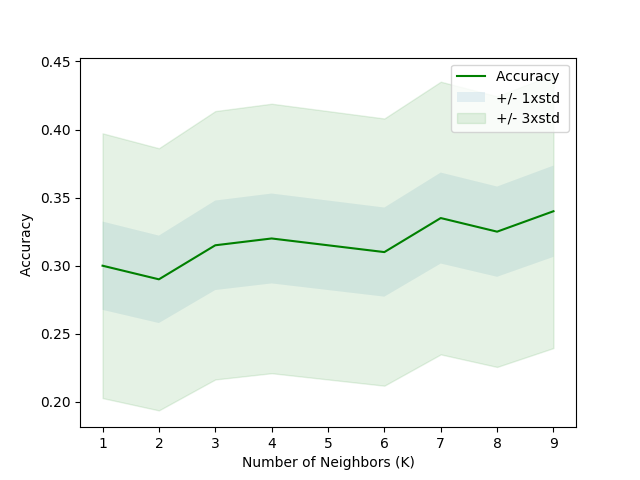

# K Nearest Neighbors
K-Nearest Neighbors is a supervised learning algorithm where the data is 'trained' with data points corresponding to their classification. To predict the class of a given data point, it takes into account the classes of the 'K' nearest data points and chooses the class in which the majority of the 'K' nearest data points belong to as the predicted class.
 

I created a model which can predict the type of service/class that the customer will be offered based on the dempgraphic information given in the dataset. The following graph shows the classification of the services which we can then use to predict the service for a customer in the test dataset. 
I used the KNN algorithm to predict the best outcome for my model. By using different values of K (neighbors) I couldl find out which value of K gave the best accuracy.This can be seen in the graph below. 

 

